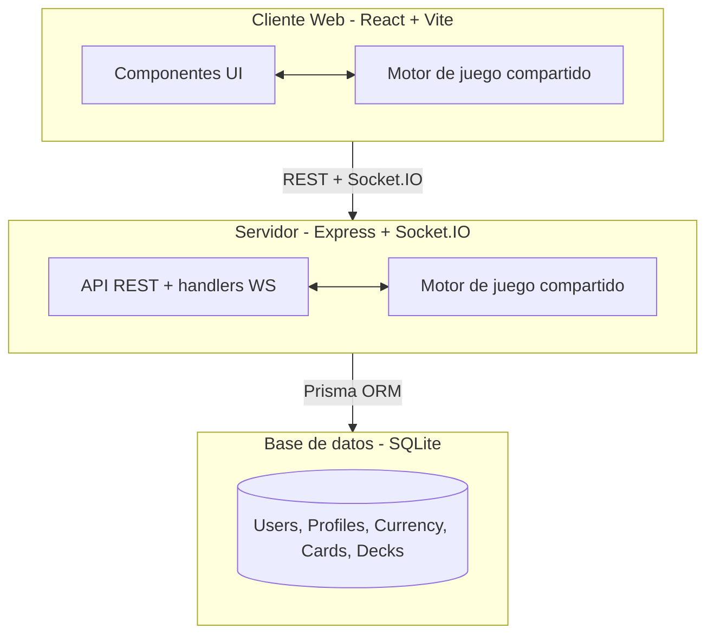
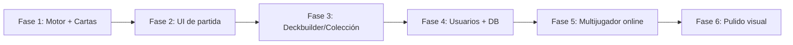

# Memoria final del proyecto — Infradeck

> TCG 1v1 digital full-stack: motor de juego propio, multijugador online en tiempo real, sistema de usuarios y persistencia.

*Documento pensado para exportar a PDF.*


## Índice

1. [Introducción](#1-introducción)
2. [Objetivos](#2-objetivos)
3. [Tecnologías utilizadas](#3-tecnologías-utilizadas)
4. [Arquitectura y estructura](#4-arquitectura-y-estructura)
5. [Funcionalidades implementadas](#5-funcionalidades-implementadas)
6. [Problemas encontrados y soluciones aplicadas](#6-problemas-encontrados-y-soluciones-aplicadas)
7. [Evolución del proyecto durante el curso](#7-evolución-del-proyecto-durante-el-curso)
8. [Conclusiones y posibles mejoras futuras](#8-conclusiones-y-posibles-mejoras-futuras)


## 1. Introducción

### 1.1. Contexto

Los juegos de cartas coleccionables digitales (TCG) tienen una base de jugadores enorme: Hearthstone, Magic Arena o Legends of Runeterra suman decenas de millones de usuarios. Sin embargo, la mayoría se sitúa en dos extremos: muy accesibles pero poco profundos (Hearthstone) o muy profundos pero con una curva de entrada alta (Magic).

**Infradeck** nace para ocupar ese espacio intermedio: un TCG 1v1 con profundidad táctica real (sistema de pila/stack y prioridad) pero más accesible, con **clases asimétricas** que cambian radicalmente la forma de jugar.

### 1.2. Justificación

El proyecto permite aplicar y demostrar competencias de desarrollo full-stack en un sistema complejo y real:
- Diseño e implementación de un **motor de juego** con reglas no triviales.
- **UI reactiva** con interacciones avanzadas (targeting, discover, scry).
- **Backend** con API REST, autenticación y comunicación en tiempo real.
- **Persistencia** con base de datos relacional.

### 1.3. Propuesta de valor

> "Infradeck combina la profundidad estratégica del stack de Magic con la accesibilidad de Hearthstone, presentando clases únicas con mecánicas asimétricas: construir el Espécimen Perfecto (Abominación), controlar el caos con Entropía (Caos) o sacrificar vida por poder (Vitalidad)."


## 2. Objetivos

### 2.1. Objetivo general

Desarrollar una aplicación web full-stack completa de un TCG 1v1 jugable contra IA y contra otros jugadores online.

### 2.2. Objetivos específicos

| # | Objetivo | Estado |
|---|----------|--------|
| 1 | Diseñar un sistema de juego con 3 clases únicas (Abominación, Caos, Vitalidad) | ✅ |
| 2 | Implementar un motor de juego robusto con pila, prioridad y triggers | ✅ |
| 3 | Desarrollar la UI web de partida (targeting, discover, scry, feedback) | ✅ |
| 4 | Implementar sistema de usuarios (registro/login, JWT, persistencia) | ✅ |
| 5 | Desarrollar multijugador online con matchmaking y sincronización en tiempo real | ✅ |
| 6 | Crear sistema de colección y mazos por usuario | 🔄 Parcial (modelo de datos + pantallas base) |
| 7 | Documentar diseño, desarrollo y testing | ✅ |


## 3. Tecnologías utilizadas

| Capa | Tecnología | Versión | Justificación |
|------|------------|---------|---------------|
| Frontend | React | 18/19 | Ecosistema maduro, componentes reutilizables |
| Build tool | Vite | 7.x | Build rápido, HMR excelente |
| Styling | Tailwind CSS | 3.4 | Utility-first, desarrollo rápido |
| Animaciones | Framer Motion | 12.x | Animaciones declarativas en React |
| Lenguaje | TypeScript | 5.9 | Type safety crítica en lógica compleja |
| Backend | Node.js + Express | 20+ / 4.x | JavaScript isomórfico, simple y extendido |
| Real-time | Socket.IO | 4.x | WebSockets con rooms, reconexión y fallback |
| ORM | Prisma | 6.x | Type-safe, migraciones sencillas |
| Base de datos | SQLite | - | Ligera, sin infraestructura adicional |
| Auth | JWT + bcryptjs | - | Tokens stateless + hashing seguro de contraseñas |
| Auth (social) | Google Identity (`@react-oauth/google` + `google-auth-library`) | - | Login con Google verificado en backend |
| Testing | Vitest / Node test runner (tsx) | - | Vitest en shared, `tsx --test` en server |
| IDs | nanoid | 5.x | IDs únicos para jugadores y salas |

**Decisiones clave:**
- **Monorepo manual** con paquetes enlazados (`file:` + path aliases) → compartir el motor de juego entre frontend y backend.
- **TypeScript full-stack** → seguridad de tipos en toda la lógica.
- **Efectos declarativos con dispatcher** → las cartas se definen como datos y se ejecutan mediante handlers registrados.
- **Socket.IO frente a WebSockets nativos** → rooms, reconexión y eventos tipados con mucho menos boilerplate.


## 4. Arquitectura y estructura

### 4.1. Arquitectura global



El **motor de juego** vive en `@infradeck/shared` y se reutiliza tanto en el cliente (partidas contra IA) como en el servidor (partidas online, donde el servidor es la fuente de verdad).

### 4.2. Estructura del monorepo

```
packages/shared/   → Motor de juego, tipos, cartas (@infradeck/shared)
packages/server/   → Express + Socket.IO + Prisma (SQLite)
web/               → Frontend React + Vite + Tailwind
apps/web/          → Frontend legacy (NO usar)
docs/              → Documentación (diseño, desarrollo, testing, entrega)
```

### 4.3. Motor de juego (`packages/shared`)

```
src/
├── engine/
│   ├── game-state.ts        # GameState, PlayerState, CreatureOnBoard
│   ├── turns.ts             # startTurn, endTurn, draw
│   ├── combat.ts            # declareAttackHero, declareAttackCreature
│   ├── priority.ts          # notifyEffectTriggered, notifyCardPlayed
│   ├── effects/
│   │   ├── dispatcher.ts    # applyAction + EFFECT_HANDLERS
│   │   ├── core.ts          # EffectContext, condiciones
│   │   ├── board-effects.ts
│   │   ├── global-effects.ts
│   │   ├── caos-effects.ts
│   │   ├── vitalidad-effects.ts
│   │   ├── abominacion-effects.ts
│   │   └── transform-effects.ts
│   ├── final-stand.ts
│   ├── specimen.ts
│   └── card-validator.ts
├── cards/
│   ├── basic-cards.ts       # cartas neutrales
│   └── class-cards.ts       # cartas de clase
└── types/cards.ts           # tipos, enums, GAME_CONSTANTS
```

### 4.4. Backend (`packages/server`)

Arquitectura monolítica en `index.ts` que combina rutas HTTP y handlers Socket.IO.

```
src/
├── index.ts              # Express + Socket.IO + rutas + handlers WS
├── db.ts                 # Singleton PrismaClient
├── game-engine.ts        # Bridge dinámico al engine de shared
├── gameRoom.ts           # GameRoomManager (partidas en memoria)
├── matchmaking.ts        # Cola FIFO de matchmaking
├── card-resolver.ts      # Lookup de cartas desde shared
├── target-detector.ts    # Detección de targets pre-engine
├── game-handlers.ts      # Hooks discover/scry
├── auth-economy-utils.ts # Utilidades auth + economía
└── types.ts              # Tipos de eventos Socket.IO
prisma/
├── schema.prisma         # User, UserProfile, UserCurrency, UserCard, Deck, DeckCard
├── dev.db                # SQLite
└── migrations/
```

**Endpoints REST principales:**

```
POST   /auth/register      # Crear cuenta
POST   /auth/login         # Login → JWT (7d)
POST   /auth/google        # Login/registro con ID token de Google
GET    /me                 # Perfil + stats (requireAuth)
GET    /me/collection      # Colección del usuario (requireAuth)
GET    /me/decks           # Mazos con cartas (requireAuth)
POST   /me/decks           # Crear/actualizar mazo (requireAuth)
DELETE /me/decks/:id       # Borrar mazo (requireAuth)
POST   /me/rewards         # Añadir gold/gems (requireAuth)
GET    /health             # Health check
```

### 4.5. Frontend (`web`)

```
src/
├── components/            # Card, GameBoard, OnlineGameBoard, Hand, UnifiedTargetModal,
│                          # DiscoverModal, ScryModal, Landing, AuthScreen, HomeScreen,
│                          # OnlineMatchmaking, DeckManagerScreen, CollectionScreen, ProfileScreen
├── context/
│   ├── GameEngineProvider.tsx   # Estado partida local + bot
│   ├── AuthContext.tsx          # Login/registro/token
│   └── OnlineGameProvider.tsx   # Socket.IO + estado online
├── services/websocket.ts        # WebSocketService (singleton)
└── main.tsx
```

**Patrones:**
- `GameBoard` se comparte entre partida local y online (`OnlineGameBoard` lo envuelve).
- La lógica pesada (targeting, discover, scry, bot) vive en los Contexts, no en los componentes.
- Navegación manual con `useState<Route>` (sin React Router).
- 3 Contexts: Auth, GameEngine (local), OnlineGame.

### 4.6. Base de datos (Prisma + SQLite)

Modelos: `User` (1:1 `UserProfile`, 1:1 `UserCurrency`, 1:N `UserCard`, 1:N `Deck`), `Deck` (1:N `DeckCard`).

```prisma
model User {
  id           String        @id @default(cuid())
  username     String        @unique
  email        String        @unique
  passwordHash String
  profile      UserProfile?
  currency     UserCurrency?
  cards        UserCard[]
  decks        Deck[]
}
```


## 5. Funcionalidades implementadas

### 5.1. Motor de juego

- **Sistema de turnos** con fases, robo de cartas y triggers `START_OF_TURN` / `END_OF_TURN`.
- **Sistema de pila (stack)** con resolución LIFO y ventanas de prioridad (`getStack`, `canRespond`, `respondWithCard`, `passPriority`, `resolveStack`).
- **Combate** por selección (atacante → criatura o héroe).
- **9 habilidades de criatura**: Prisa, Impaciente, Taunt, Sigilo, Escudo, Veneno, Robo de Vida, Vuelo, Regeneración (+ Doble Golpe).
- **Final Stand**: mecánica de "último aliento" con bonus según clase.
- **3 clases asimétricas**:
  - **Abominación** → Espécimen con costo escalable (5→7→9→10) que hereda habilidades del cementerio.
  - **Caos** → recurso Entropía, efectos `RANDOM_BY_ENTROPY` (daño/efectos escalados).
  - **Vitalidad** → sacrificio de vida por poder, escalado por diferencial de vida.
- **Efectos avanzados**: `DISCOVER_FROM_GRAVEYARD`, `LIFE_DIFFERENTIAL`, `COUNTER_SPELL`, `FREE_SUMMON_THIS_TURN`.
- **70+ cartas** validadas (cartas básicas + cartas de clase).

### 5.2. Partida local (vs IA)

- Selección de mazo y arranque de partida.
- Bot local que juega cartas asequibles, ataca y finaliza turno (con candado por turno).
- UI completa: tablero, mano (fan-out), vida/maná, modal de targeting unificado, discover y scry.

### 5.3. Multijugador online

- **Matchmaking** FIFO vía Socket.IO.
- **Salas de juego** en memoria (`GameRoomManager`).
- **Servidor authoritative**: toda acción se valida en el servidor con el engine de shared y se difunde el estado.
- Eventos tipados cliente↔servidor (`matchmaking:*`, `game:playCard`, `game:attack`, `game:endTurn`, `game:discoverResponse`, `game:scryResponse`, `game:stateUpdate`, `game:over`...).

### 5.4. Sistema de usuarios

- **Registro y login** con email/contraseña (passwords hasheados con bcryptjs).
- **Login con Google** (ID token verificado en backend; vincula cuenta si el email ya existe).
- **JWT** (`Authorization: Bearer`, expiración 7 días) y middleware `requireAuth`.
- **Perfil** con nivel/XP, **monedas** (gold/gems), **colección** y **mazos** persistidos.


## 6. Problemas encontrados y soluciones aplicadas

| Problema | Impacto | Solución aplicada |
|----------|---------|-------------------|
| Estado divergente entre UI y engine | Alto | Unificar el estado en `GameEngineProvider` (única fuente de verdad en cliente) |
| Mano vacía en el primer render | Medio | Inicializar el resolver con `useLayoutEffect` |
| El bot jugaba varias veces por turno | Alto | Candado `processedTurnRef` por turno |
| Cartas sin arrays provocaban crashes | Medio | Normalización segura con `Array.isArray()` |
| Resolución del stack LIFO compleja | Alto | Tests específicos del engine + documentación de reglas |
| Espécimen "spameable" | Alto | Costo escalable (5→7→9→10) |
| Timing de COUNTER_SPELL | Medio | Flag `counterSpellPending` (contrarresta el próximo hechizo, no cancela items ya en pila) |
| Reutilizar el engine en server (ESM) | Medio | Dynamic imports al paquete shared (`game-engine.ts` como bridge) |
| Identidad de cuenta vs identidad de partida | Medio | Capas separadas (REST/JWT y Socket/playerId); documentada como mejora pendiente |


## 7. Evolución del proyecto durante el curso



| Fase | Descripción | Estado |
|------|-------------|--------|
| Fase 1 | Motor de juego, 70+ cartas, tests | ✅ Completada |
| Fase 2 | UI de partida (tablero, mano, combate, targeting, discover, scry, bot) | ✅ Completada |
| Fase 3 | Deckbuilder y colección | 🔄 Parcial |
| Fase 4 | Usuarios (JWT + Google), Prisma/SQLite | ✅ Completada |
| Fase 5 | Multijugador online (Socket.IO, matchmaking) | ✅ Completada |
| Fase 6 | Pulido, animaciones, responsive | 🔄 En progreso |

**Cambios de diseño durante el desarrollo:**
- Espécimen: de costo fijo → costo escalable (mejor balance).
- Counter spell: de cancelar item en pila → flag pendiente (más simple y robusto).
- Final Stand: de simple +10 vida → bonus por clase (más interesante).


## 8. Conclusiones y posibles mejoras futuras

### 8.1. Conclusiones

- Se ha construido un **motor de juego robusto y testeado** con mecánicas no triviales (pila, prioridad, efectos por clase, Final Stand, Espécimen).
- Se ha logrado un **juego jugable de extremo a extremo**: vs IA en local y **PvP online** con servidor authoritative.
- El **monorepo con paquete compartido** permitió reutilizar el engine en cliente y servidor, evitando duplicar lógica.
- **TypeScript y testing desde el inicio** dieron confianza para refactorizar y previnieron numerosos bugs.
- **Socket.IO** simplificó enormemente la implementación de multijugador frente a WebSockets nativos.

### 8.2. Mejoras futuras

- **Deckbuilder y colección** completos (apertura de sobres, drag & drop, filtros).
- **Autenticación JWT en el handshake de Socket.IO** para vincular socket ↔ cuenta y cerrar la separación actual entre identidad REST y de partida.
- **Rate limiting** en eventos Socket.IO y endpoints REST.
- **Reconexión** y persistencia de partidas (actualmente in-memory; se pierden al reiniciar el servidor).
- **Migración a PostgreSQL** para producción (SQLite es suficiente en desarrollo).
- **Tests de usabilidad reales** y **tests de integración WebSocket**.
- **Pulido visual**: animaciones, pantalla de victoria/derrota, responsive móvil.
- **Historial de partidas y ranking**.
