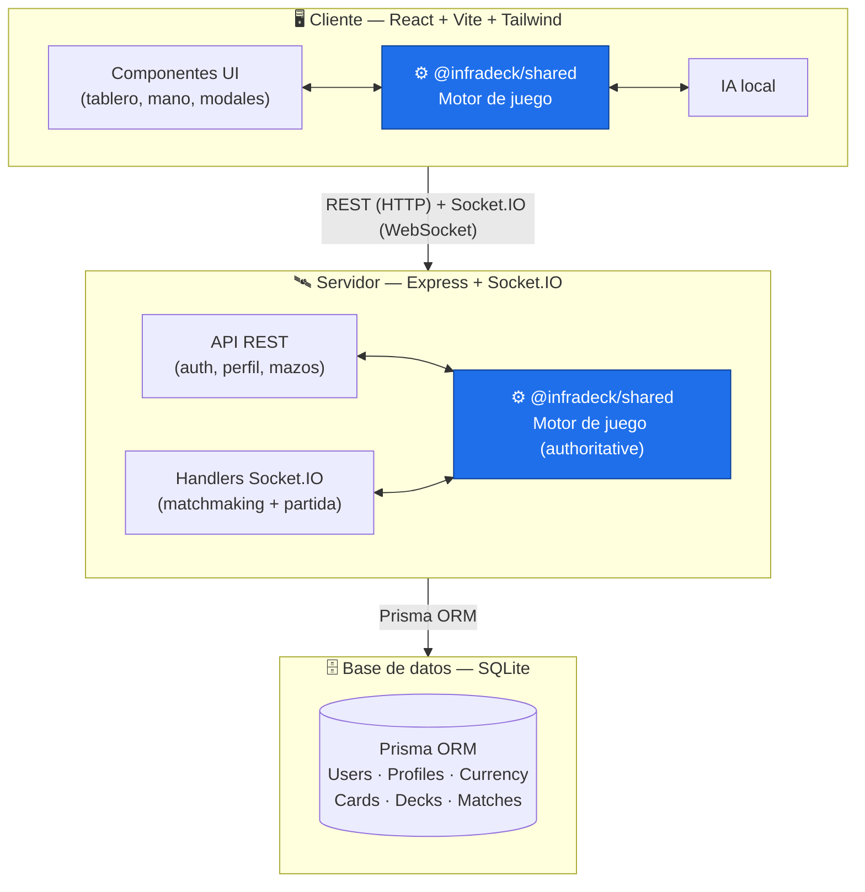

# Vídeo-presentación — Infradeck

Guion temporizado para el vídeo (**máximo 10 minutos**). Incluye explicación general, funcionalidades principales, decisiones técnicas y demostración básica. Se valora claridad, capacidad comunicativa, organización y una calidad mínima de sonido e imagen.

> Antes de grabar: tener el backend (`packages/server`) y el frontend (`web`) arrancados, una cuenta creada y un mazo listo. Grabar pantalla a 1080p y micro en sitio silencioso. Hablar despacio y con guion.

---

## Estructura general (≈10 min)

| Bloque                       | Duración   | Contenido                                                     | Qué mostrar                  |
| ---------------------------- | ---------- | ------------------------------------------------------------- | ---------------------------- |
| 1. Introducción              | 0:00–1:00  | Qué es Infradeck y qué problema resuelve                      | Portada / tablero            |
| 2. Visión general y stack    | 1:00–2:30  | Tecnologías y arquitectura                                    | Diagrama de arquitectura     |
| 3. Demo: partida vs IA       | 2:30–5:00  | Jugar cartas, combate, targeting, discover/scry               | Pantalla del juego           |
| 4. Demo: multijugador online | 5:00–7:00  | Matchmaking y partida entre 2 clientes                        | Dos ventanas del navegador   |
| 5. Decisiones técnicas       | 7:00–9:00  | Engine compartido, server authoritative, efectos declarativos | Editor de código / diagramas |
| 6. Cierre                    | 9:00–10:00 | Evolución, conclusiones y futuro                              | Línea de tiempo de fases     |

---

## Guion detallado

### Bloque 1 — Introducción (0:00–1:00)

> "Hola, soy [nombre]. Os presento **Infradeck**, un juego de cartas coleccionables 1v1 que he desarrollado como proyecto final. Es una aplicación web full-stack: se puede jugar contra una IA en local y contra otros jugadores online en tiempo real. Su rasgo diferencial son **tres clases asimétricas** —Abominación, Caos y Vitalidad— que cambian por completo la forma de jugar, sobre un motor de juego propio con sistema de pila y prioridad."

- **Mostrar:** el tablero de juego o la portada.

### Bloque 2 — Visión general y stack (1:00–2:30)

> "El proyecto es un **monorepo** con tres paquetes: `shared`, que contiene el motor de juego; `server`, el backend con Express y Socket.IO; y `web`, el frontend en React. Todo está escrito en TypeScript. La clave es que el **motor de juego es compartido**: el mismo código se usa en el cliente para partidas contra la IA y en el servidor para las partidas online."

- **Mostrar:** diagrama de arquitectura (cliente ↔ servidor ↔ base de datos SQLite con Prisma).

> **Idea clave:** el mismo motor (`@infradeck/shared`, en azul) corre en cliente y servidor. En local resuelve partidas vs IA; online el **servidor es la fuente de verdad** y difunde el estado por Socket.IO.

### Bloque 3 — Demo: partida contra IA (2:30–5:00)

> "Inicio sesión, elijo un mazo y empiezo una partida contra la IA. Aquí veis la mano, el tablero y la vida y el maná de cada jugador."

Acciones a mostrar:

1. Jugar una criatura (bloqueo por maná).
2. Atacar (seleccionar atacante → objetivo).
3. Jugar un hechizo con **targeting** (modal de selección de objetivo).
4. Mostrar un efecto **discover** o **scry**.
5. El bot responde y finaliza su turno.

> "Cada acción tiene feedback visual inmediato, y mecánicas como el targeting o el discover se resuelven con modales dedicados."

### Bloque 4 — Demo: multijugador online (5:00–7:00)

> "Ahora el modo online. Abro dos ventanas del navegador con dos cuentas. Ambas entran en **matchmaking** y el servidor las empareja en una sala."

Acciones a mostrar:

1. Las dos ventanas entran a matchmaking.
2. El servidor las empareja y arranca la partida.
3. Una jugada en una ventana se refleja en la otra.

> "El **servidor es la fuente de verdad**: cada acción se valida en el servidor con el motor de juego y luego se difunde el estado a ambos jugadores. Así se evita que un cliente haga trampas."

### Bloque 5 — Decisiones técnicas (7:00–9:00)

> "Tres decisiones importantes:"
>
> 1. **Engine compartido**: el mismo motor en cliente y servidor evita duplicar lógica y mantener dos versiones de las reglas.
> 2. **Efectos declarativos con dispatcher**: las cartas se definen como datos y un dispatcher las ejecuta con handlers registrados; añadir una carta nueva no requiere tocar el motor.
> 3. **Server authoritative en online**: el servidor valida y difunde, los clientes solo envían intenciones.

- **Mostrar:** `packages/shared/src/engine/effects/dispatcher.ts` y `packages/server/src/index.ts` (handlers Socket.IO) por encima.

### Bloque 6 — Cierre (9:00–10:00)

> "El proyecto ha evolucionado por fases: del motor de juego a la UI, después usuarios y base de datos, y finalmente el multijugador online. Como mejoras futuras me quedan el deckbuilder completo, la autenticación JWT en el handshake de Socket.IO y un sistema de ranking. Gracias por ver el vídeo."

- **Mostrar:** línea de tiempo de fases / conclusiones.

---

## Checklist técnico antes de grabar

- Backend y frontend arrancados (`npm run dev` en `packages/server` y `web`).
- Base de datos migrada (`npx prisma migrate dev`).
- Cuenta(s) creada(s) y mazo(s) listo(s).
- Resolución de grabación 1080p, audio nítido.
- Probar el flujo completo una vez antes de la toma final.
- Duración final ≤ 10:00.

